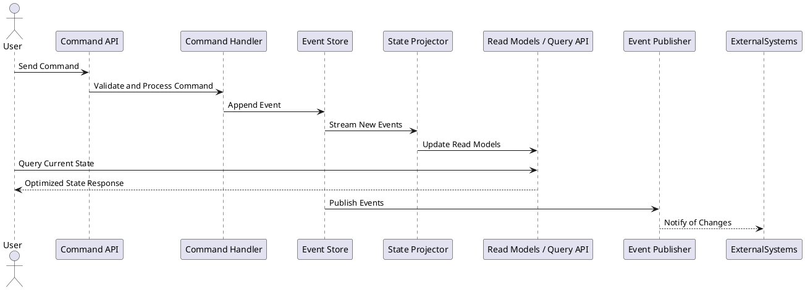

# Design Driven Development

## Adopt principles

**command, event, and state**
**Domain-Driven Design (DDD)**
**Event Sourcing**
**CQRS (Command Query Responsibility Segregation)**

## Design requirements

**high-frequency data updates**
**auditability**
**history of state changes**
**eventual consistency**
**real-time capabilities**

### Background

Modern software systems, particularly in domains such as financial trading, IoT device management, and gaming, require designs that can handle **high-frequency updates**, ensure **auditability**, and maintain a **history of state changes**. These domains often require **eventual consistency** across distributed systems, where the state is derived from a sequence of **immutable events** rather than transient snapshots.

This design leverages principles from **Command Query Responsibility Segregation (CQRS)**, **Event Sourcing**, and **Domain-Driven Design (DDD)** to ensure:

* Scalable processing of commands (user actions or system triggers).
* Events that capture the immutable history of actions and outcomes.
* State that is derived from the sequence of these events.

The architecture will prioritize **real-time capabilities**, **distributed processing**, and **reliable replayability of events** to ensure robust system behavior.

### Requirements

#### Must-Have

1. **Command Processing**:
   * The system must support commands as user or system-initiated actions that trigger state changes (e.g., `PlaceOrder` , `UpdateDeviceStatus` , `StartGameRound` ).
   * Commands must validate business rules synchronously before proceeding.

2. **Event Generation and Storage**:
   * Each command must result in one or more immutable events representing domain-specific outcomes.
   * Events must be stored in an append-only **event log** to enable replay and auditability.

3. **State Reconstruction**:
   * The system must derive the current state from the event log, ensuring eventual consistency.

4. **High-Frequency Updates**:
   * The architecture must scale horizontally to support high-frequency data updates, ensuring low-latency processing.

5. **Real-Time Capabilities**:
   * Key subsystems must publish events in real-time to external systems or user-facing components via mechanisms like WebSockets or Kafka.

#### Should-Have

1. **Read Optimization**:
   * Separate read models must be optimized for querying, independent of the event store.

2. **Event Replay**:
   * Events must be replayable to recover state or debug historical actions.

3. **Distributed Architecture**:
   * The system should leverage distributed processing for scalability and fault tolerance.

4. **Event Versioning**:
   * Support versioning of events to allow schema evolution without breaking existing consumers.

#### Could-Have

1. **Snapshots for Performance**:
   * Periodic snapshots of state could optimize state reconstruction performance for entities with long histories.

2. **Monitoring and Observability**:
   * The system could include comprehensive dashboards for command throughput, event processing latency, and error rates.

#### Won’t-Have

1. **Transactional Guarantees Across Systems**:
   * The initial design will not include strict transactional guarantees for commands spanning multiple bounded contexts.

### Method

#### Architectural Overview

The architecture will include three core layers:

1. **Command Layer**: Handles user/system actions, validates business rules, and emits domain events.
2. **Event Layer**: Manages the event log, ensuring immutability and replayability, and publishes events to interested parties.
3. **State/Read Layer**: Reconstructs the current state or provides optimized views for queries.

We’ll represent this with a **CQRS and Event Sourcing** model, leveraging distributed systems for scalability.

#### Core Components

1. **Command Handler**:
   * Accepts and validates commands.
   * Publishes domain events to the event store.

2. **Event Store**:
   * An append-only log to store events immutably.
   * Allows for replaying events to rebuild state.

3. **State Projector**:
   * Processes events to update materialized views or caches for query optimization.
   * Supports eventual consistency for read models.

4. **Query Layer**:
   * Exposes APIs or data endpoints for clients to retrieve optimized state.

5. **Event Publisher**:
   * Streams events to external systems or real-time clients using technologies like Kafka, RabbitMQ, or WebSockets.

#### Data Flow Diagram

**PlantUML diagram** that illustrates the flow of commands, events, and state transitions.



### Data Model

#### 1. **Database Schema Design**

Must need to design schemas for:

* **Event Store**: Storing immutable events.
* **Read Models**: Optimized query-specific tables or caches.

Must will provide:

* A relational schema for the event store (e.g., SQL-based).
* An example read model schema for a sample domain (e.g., an e-commerce order system).

#### 2. **Algorithm Details**

* **Command Validation**: Define how commands are validated (e.g., business rules, state preconditions).
* **Event Replay**: Detail the algorithm for rebuilding state from the event store.
* **State Projection**: Detail how events are consumed to update materialized views.

#### 3. **Technology Recommendations**

* Suggestions for event storage and streaming (e.g., Kafka, DynamoDB, Postgres).
* Frameworks for CQRS/ES (e.g., Axon, Eventuate, custom lightweight implementation).

#### 4. **Implementation Plan**

* Breaking down development into manageable milestones.
* Examples:
  * Implementing the event store and command handling.
  * Creating the projection and query layers.
  * Integrating real-time event publishers.

#### 5. **Milestones and Evaluation**

* Define milestones for tracking progress (e.g., event store MVP, read model integration).
* Describe metrics to evaluate system success (e.g., latency, throughput, replay speed).

### Database Schemas for an Agnostic Domain

#### **1. Event Store Schema**

The Event Store remains at the core, designed to accommodate any domain with flexibility.

```sql
CREATE TABLE EventStore (
    EventID SERIAL PRIMARY KEY,          -- Unique identifier for each event
    AggregateID UUID NOT NULL,           -- ID of the aggregate root/entity
    AggregateType VARCHAR(255) NOT NULL, -- Type of aggregate (e.g., Order, Device, User)
    EventType VARCHAR(255) NOT NULL,     -- Type of event (e.g., Created, Updated, Deleted)
    EventData JSONB NOT NULL,            -- Event payload in JSON format
    Metadata JSONB,                      -- Additional metadata (e.g., user, origin)
    Timestamp TIMESTAMP DEFAULT NOW(),   -- Timestamp of the event
    Version INT NOT NULL                 -- Version for optimistic concurrency control
);

-- Indexes for fast querying by aggregate and event type
CREATE INDEX idx_aggregate_id ON EventStore (AggregateID);
CREATE INDEX idx_aggregate_type ON EventStore (AggregateType);
CREATE INDEX idx_event_type ON EventStore (EventType);
```

#### **2. Read Model Schema**

The Read Model is generalized to store **materialized views** for queries. Each domain can define its own projections as needed. For example:

```sql
CREATE TABLE GenericReadModel (
    EntityID UUID PRIMARY KEY,           -- ID of the entity (matches AggregateID)
    EntityType VARCHAR(255) NOT NULL,    -- Type of entity (e.g., Order, Device, User)
    State JSONB NOT NULL,                -- Current state as a JSON document
    LastEventVersion INT NOT NULL,       -- Last processed event version
    LastUpdated TIMESTAMP DEFAULT NOW()  -- Timestamp of the last update
);

-- Indexes for querying specific types or entities
CREATE INDEX idx_entity_type ON GenericReadModel (EntityType);
CREATE INDEX idx_last_event_version ON GenericReadModel (LastEventVersion);
```

#### **3. Snapshot Schema (Optional)**

For aggregates with long histories, snapshots store periodic summaries of state to optimize performance.

```sql
CREATE TABLE GenericSnapshots (
    AggregateID UUID PRIMARY KEY,        -- ID of the aggregate root/entity
    AggregateType VARCHAR(255) NOT NULL, -- Type of aggregate (e.g., Order, Device, User)
    SnapshotData JSONB NOT NULL,         -- Serialized state of the entity
    LastEventVersion INT NOT NULL,       -- Version of the last event in the snapshot
    Timestamp TIMESTAMP DEFAULT NOW()    -- Timestamp of the snapshot creation
);

-- Index for fast lookup by aggregate type
CREATE INDEX idx_snapshot_type ON GenericSnapshots (AggregateType);
```

#### Schema Features

1. **Flexibility**: Supports multiple domains by leveraging JSON for data storage.
2. **Scalability**: Indexes enable fast lookups for high-frequency queries.
3. **Auditability**: EventStore retains a full history of changes.

### Implementation in TypeScript

#### **1. Command Validation and Processing**

Commands are objects representing intent. Here’s how we can validate and handle them:

```typescript
// Command interface
interface Command {
  aggregateId: string; // Target entity ID
  aggregateType: string; // Type of entity (e.g., "Order")
  type: string; // Command type (e.g., "CreateOrder")
  payload: any; // Command-specific data
}

// Example: Command handler
class CommandHandler {
  async handle(command: Command): Promise<void> {
    // Validate command
    this.validate(command);

    // Apply business rules (this is domain-specific)
    const events = this.applyBusinessRules(command);

    // Store events in the EventStore
    for (const event of events) {
      await EventStore.save(event);
    }
  }

  private validate(command: Command): void {
    if (!command.aggregateId || !command.type) {
      throw new Error("Invalid command: Missing aggregateId or type");
    }
    // Additional validation rules per domain
  }

  private applyBusinessRules(command: Command): Event[] {
    // Mocking business logic: Generate events
    return [
      {
        aggregateId: command.aggregateId,
        aggregateType: command.aggregateType,
        type: `${command.type}Processed`, // E.g., "CreateOrderProcessed"
        payload: command.payload,
        metadata: { timestamp: new Date().toISOString() },
        version: 1,
      },
    ];
  }
}
```

##### Sugestions

* Use a **transaction** to ensure atomicity when saving events.
* Implement **optimistic concurrency control** to handle concurrent updates.
* Consider using **PostgreSQL** for its robust support for JSON and indexing capabilities.
* Offload command processing to a **queue** to handle high-volume commands.

#### **2. Event Storage and Retrieval**

Here’s how to handle event storage and retrieval using a PostgreSQL-based event store.

```typescript
import { Pool } from "pg";

// PostgreSQL connection pool
const pool = new Pool({
  user: "user",
  host: "localhost",
  database: "eventstore",
  password: "password",
  port: 5432,
});

interface EventPayload {
    // Define specific payload schemas per event type
    [key: string]: any;
}

interface EventMetadata {
    timestamp: string;
    userId?: string;
    [key: string]: any;
}

// Event interface
interface Event {
  aggregateId: string;
  aggregateType: string;
  type: string;
  payload: EventPayload;
  metadata: EventMetadata;
  version: number;
  timestamp?: string;
}

class ErrorHandler {
    static handle(error: Error): void {
        console.error("Error occurred:", error.message);
        // Optionally, integrate with a monitoring service like Sentry
    }
}

// EventStore class
class SQLEventStore {
  static async save(event: Event): Promise<void> {
    const query = `
      INSERT INTO EventStore (AggregateID, AggregateType, EventType, EventData, Metadata, Version, Timestamp)
      VALUES ($1, $2, $3, $4, $5, $6, NOW())
    `;
    const values = [
      event.aggregateId,
      event.aggregateType,
      event.type,
      JSON.stringify(event.payload),
      JSON.stringify(event.metadata),
      event.version,
    ];
    try {
        await pool.query(query, values);
    } catch (error) {
        ErrorHandler.handle(error);
        throw new Error("Failed to save event");
    }
  }

  static async getEvents(aggregateId: string): Promise<Event[]> {
    const query = `
      SELECT * FROM EventStore WHERE AggregateID = $1 ORDER BY Version ASC
    `;
    try {
        const result = await pool.query(query, [aggregateId]);
    return result.rows.map((row) => ({
      aggregateId: row.aggregateid,
      aggregateType: row.aggregatetype,
      type: row.eventtype,
      payload: row.eventdata,
      metadata: row.metadata,
      version: row.version,
      timestamp: row.timestamp,
    }));
    } catch (error) {
        ErrorHandler.handle(error);
        throw new Error("Failed to fetch events");
    }
  }
}


// EventRepository
class EventRepository {
    async saveEvent(event: Event): Promise<void> {
        await SQLEventStore.save(event);
    }

    async fetchEventsByAggregateId(aggregateId: string): Promise<Event[]> {
        return await SQLEventStore.getEvents(aggregateId);
    }
}

```

#### **3. Event Replay for State Reconstruction**

Rebuilding the state involves replaying all events for a given aggregate.

```typescript
class StateRebuilder {
  static async rebuildState(aggregateId: string): Promise<any> {
    const events = await EventStore.getEvents(aggregateId);

    let state = {}; // Initialize empty state
    for (const event of events) {
      state = this.applyEvent(state, event);
    }

    return state;
  }

  private static applyEvent(currentState: any, event: Event): any {
    // Example event handling logic
    switch (event.type) {
      case "CreateOrderProcessed":
        return { ...currentState, ...event.payload };
      case "UpdateOrderStatus":
        return { ...currentState, status: event.payload.status };
      default:
        return currentState; // Ignore unknown events
    }
  }
}
```

#### Summary of Key Concepts

1. **Commands** trigger state changes through `CommandHandler`, which validates and generates events.
2. **EventStore** saves events in a database using PostgreSQL.
3. **StateRebuilder** replays events from the EventStore to reconstruct the current state.

### **1. Read Models**

**Read Models** provide optimized views of the current state derived from events. These views are updated asynchronously and tailored for fast querying.

#### Read Model Projection

**Projection** is the process of transforming and updating the Read Model whenever new events are received.

```typescript
// Example Read Model Schema
interface ReadModel {
  entityId: string;
  entityType: string;
  state: any;
  lastEventVersion: number;
}

// Projection logic
class ReadModelProjector {
  static async projectEvent(event: Event): Promise<void> {
    const existingModel = await this.getReadModel(event.aggregateId);

    const updatedState = this.applyEvent(existingModel?.state || {}, event);

    // Upsert the Read Model
    if (existingModel) {
      await this.updateReadModel(event.aggregateId, updatedState, event.version);
    } else {
      await this.createReadModel(event.aggregateId, event.aggregateType, updatedState, event.version);
    }
  }

  private static applyEvent(currentState: any, event: Event): any {
    // Define event-specific projection logic
    switch (event.type) {
      case "CreateOrderProcessed":
        return { ...currentState, ...event.payload };
      case "UpdateOrderStatus":
        return { ...currentState, status: event.payload.status };
      default:
        return currentState; // Ignore unknown events
    }
  }

  private static async getReadModel(entityId: string): Promise<ReadModel | null> {
    const query = `
      SELECT * FROM GenericReadModel WHERE EntityID = $1
    `;
    const result = await pool.query(query, [entityId]);
    return result.rows[0] || null;
  }

  private static async createReadModel(entityId: string, entityType: string, state: any, version: number): Promise<void> {
    const query = `
      INSERT INTO GenericReadModel (EntityID, EntityType, State, LastEventVersion, LastUpdated)
      VALUES ($1, $2, $3, $4, NOW())
    `;
    const values = [entityId, entityType, JSON.stringify(state), version];
    await pool.query(query, values);
  }

  private static async updateReadModel(entityId: string, state: any, version: number): Promise<void> {
    const query = `
      UPDATE GenericReadModel
      SET State = $1, LastEventVersion = $2, LastUpdated = NOW()
      WHERE EntityID = $3
    `;
    const values = [JSON.stringify(state), version, entityId];
    await pool.query(query, values);
  }
}
```

#### Real-Time Read Models

You can extend this projection to populate a **cache** (e.g., Redis) for faster queries if latency is critical.

```typescript
import { createClient } from "redis";

const redisClient = createClient();

class CachedReadModelProjector extends ReadModelProjector {
  static async projectEvent(event: Event): Promise<void> {
    super.projectEvent(event);

    // Update cache
    const updatedModel = await this.getReadModel(event.aggregateId);
    if (updatedModel) {
      await redisClient.set(event.aggregateId, JSON.stringify(updatedModel));
    }
  }

  static async getCachedReadModel(entityId: string): Promise<ReadModel | null> {
    const cached = await redisClient.get(entityId);
    return cached ? JSON.parse(cached) : null;
  }
}
```

### **2. Event Publishers**

Event publishers ensure that domain events are shared with other subsystems, external services, or real-time consumers. Technologies like **Kafka**, **RabbitMQ**, or **WebSockets** can be used.

#### Event Publisher with Kafka

Example of publishing events using Kafka:

```typescript
import { Kafka } from "kafkajs";

const kafka = new Kafka({
  clientId: "event-service",
  brokers: ["localhost:9092"],
});

const producer = kafka.producer();
const consumer = kafka.consumer({ groupId: "event-group" });

class KafkaEventStore {
  static async publish(event: Event): Promise<void> {
    await producer.connect();
    await producer.send({
      topic: event.aggregateType,
      messages: [
        {
          key: event.aggregateId,
          value: JSON.stringify(event),
        },
      ],
    });
    await producer.disconnect();
  }

  static async subscribe(eventType: string, handler: (event: Event) => Promise<void>): Promise<void> {
    await consumer.connect();
    await consumer.subscribe({ topic: eventType, fromBeginning: true });

    consumer.run({
      eachMessage: async ({ message }) => {
        const event: Event = JSON.parse(message.value!.toString());
        await handler(event);
      },
    });
  }
}

// Usage: Publish an event
await KafkaEventStore.publish({
  aggregateId: "1234",
  aggregateType: "Order",
  type: "OrderPlaced",
  payload: { orderDetails: "Sample Order" },
  metadata: { timestamp: new Date().toISOString() },
  version: 1,
});
```

#### WebSocket Publisher for Real-Time Events

Use WebSockets to push events to clients for real-time updates.

```typescript
import WebSocket from "ws";

const wss = new WebSocket.Server({ port: 8080 });

class WebSocketEventPublisher {
  static publish(event: Event): void {
    wss.clients.forEach((client) => {
      if (client.readyState === WebSocket.OPEN) {
        client.send(JSON.stringify(event));
      }
    });
  }
}
```

#### Integrating the Event Publisher

Modify the **Event Store** to invoke the publisher after storing the event:

```typescript
class EventStore {
  static async save(event: Event): Promise<void> {
    const query = `
      INSERT INTO EventStore (AggregateID, AggregateType, EventType, EventData, Metadata, Version, Timestamp)
      VALUES ($1, $2, $3, $4, $5, $6, NOW())
    `;
    const values = [
      event.aggregateId,
      event.aggregateType,
      event.type,
      JSON.stringify(event.payload),
      JSON.stringify(event.metadata),
      event.version,
    ];
    await pool.query(query, values);

    // Publish the event
    await KafkaEventPublisher.publish(event);
    WebSocketEventPublisher.publish(event);
  }
}
```

### Summary

1. **Read Models**:
   * Use `ReadModelProjector` to update materialized views from events.
   * Optionally extend with `CachedReadModelProjector` for low-latency queries via Redis.

2. **Event Publishers**:
   * Use `KafkaEventPublisher` for robust inter-system communication.
   * Use `WebSocketEventPublisher` for real-time event delivery.

I like to dive deeper into integrating these with specific frameworks and next discuss testing strategies for these components?
